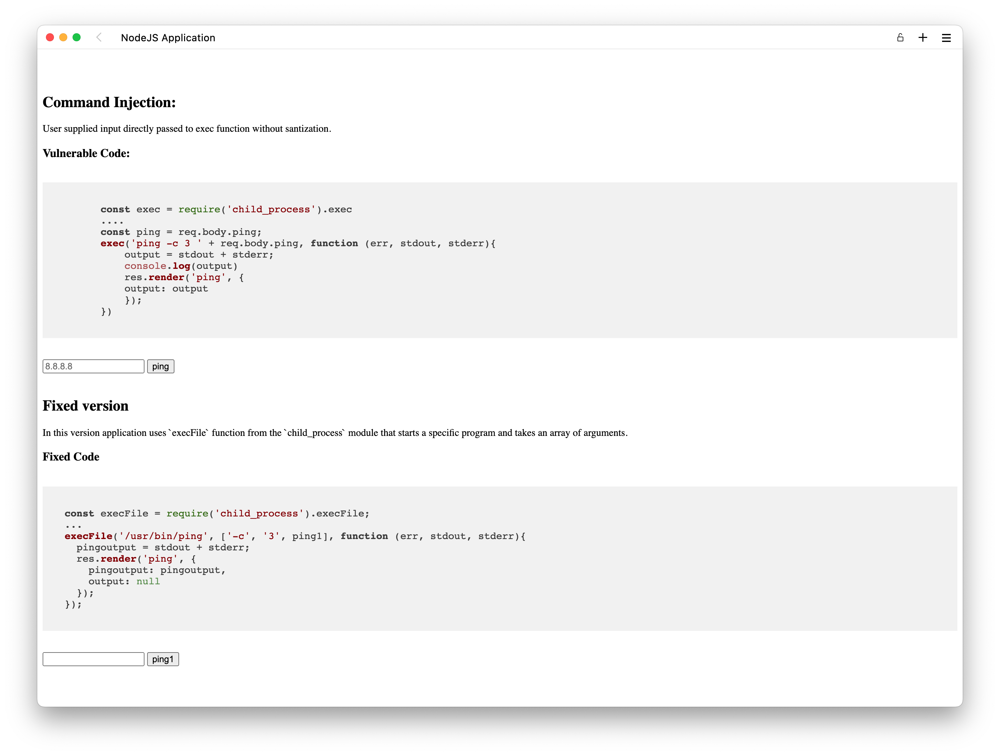

# Workshop de Análisis y Remediación de Código con Snyk

### Contenido del Workshop

1. [Diclaimer](#Disclaimer)
2. [Requerimientos del workshop](#requerimientos-del-workshop)
3. [Conociendo Snyk Open-Source](#requerimientos-del-workshop)
4. [Instalar una aplicación vulnerable](#instalar-una-aplicación-vulnerable)
5. [Conociento Snyk CLI](#conociento-snyk-cli)
6. [Mi primer análisis de Composición de Software(SCA)](#mi-primer-análisis-de-composición-de-softwaresca)
7. [Primer desafío](#primer-desafío)
8. Remediando vulnerabilidades en las dependencias
9. [Conociento Snyk Plug-in para VSCode](#conociento-snyk-plug-in-para-vscode)
10. Segundo Desafío
11. Conociendo Snyk Code
12. Remediando Vulnerabilidades en Código
13. Tercer Desafío
14. Cierre y próximos Pasos

## Disclaimer

Dependiendo en la plataforma que te encuentres algunos de los procedimientos, archivos y comandos pueden cambiar. Este workshop ha sido probado en ambientes Windows y Mac. Si te encuentras con algún error recuerda que es parte del proceso de aprendizaje y resolverlos es la gratificación. Ante cualquier error procura primero comprender el error antes de buscar en la red, es muy probable que alguien haya pasado por lo mismo que tu. Sin más que resaltar, vamos a divertirnos.

## Requerimientos del Workshop

**Requerimientos de la PC**

- Al menos 8 GB de Memoria RAM
- Espacio en Disco de xxx GB
- Contar con privilegios de Administrador

**Requerimientos de Software**

- [Instalar VSCode](#https://code.visualstudio.com/download)
- [Instalar Docker Desktop](#https://www.docker.com/products/docker-desktop/)
- Instalar NodeJS en [Mac](#https://www.youtube.com/watch?v=6VNkLyQeu3Y) o [Windows](#https://www.youtube.com/watch?v=Z-Ofqd2yBCc)
- Instalar Git en [Mac](#https://git-scm.com/download/mac) o [Windows](#https://gitforwindows.org/)
- [Crear una Cuenta en GitHub](#https://github.com/join)
- [Crear un Cuenta Free en Snyk](#https://app.snyk.io/login)

_Nota:_ Algunos sistemas operativos requieren software adicional para instalar el software

## Conociendo Snyk Open-Source

Cada vez que desarrollamos una aplicación hacemos uso de código open source. Este código en forma de librerías, son importadas a nuestra aplicación, permitiendo desarrollar aplicaciones de forma más rápita y nos evita tener que construir la misma funcionalidad una y otra vez. Estas librerías también dependen de otras más, y así se van reutilizando. Sin embargo, las librerías no están libres de tener vulnerabilidades o que alguien pueda modificar su código y es por esta razón que el uso de librerías expone a las organizaciones a tener problemas de seguridad y de licenciamiento.

**Snyk Open Source** permite analizar facilmente todas las librerías(dependencias) detectando vulnerabilidades en toda la rama de librerías. Sí, scuchaste bien, no solo analiza la librería principal, también analiza toda las librerías complementarias. Asimismo, analiza el licenciamiento de cada librería para proporcionarte una vista global del riesgo de seguridad en cuando al uso de librerías y licencias.

También puede integrarse con los sistemas de gestión de código (SCM) como github, gitlab, etc. Para analizar el codigo que está siendo almacenado en estos sistemas para determinar su riesgo actual.


A lo largo del workshop vamos a utilizar esta funcionalidad, así como otras funcionalidades de Snyk.

## Instalar una aplicación Vulnerable

Vamos a la práctica. Para el laboratorio vamos a utilizar una versión simplificada de la aplicación original: [Vulnerable NodeJS Applicaion](#https://github.com/payatu/vuln-nodejs-app). Si luego, deseas explorar más de 20 vulnerabilidades con su respectiva solución te recomiendo utilices su repositorio original; eso sí, vas a necesitar más recursos de tu computadora para correr los contenedores y también más espacio en disco.

1. Utilizando la terminal o powershell en windows. Vamos a clonar el repositorio haciendo uso de git clone y guardarlo en una carpeta snyk-workshop

```bash
git clone https://github.com/dan-breu/nodejs-cmd-injection snyk-workshop
cd snyk-workshop
```

2. Ahora abrimos docker-desktop en nuestra computadora y luego creamos el contenedor utilizando los siguientes comandos.

```bash
docker build .
docker image ls
docker run -d -p 3000:3000 <IMAGE_ID>
docker ps -a
```

3. Abrimos un navegador e ingresamos a la dirección: localhost:8080. Nos debe mostrar la siguiente ventana.
   

4. En el primer campo de texto vamos a ingresar el siguiente comando.

```bash
8.8.8.8; ls -l
```

El resultado será el siguiente

```bash
Command Output

PING 8.8.8.8 (8.8.8.8) 56(84) bytes of data.
64 bytes from 8.8.8.8: icmp_seq=1 ttl=37 time=53.4 ms
64 bytes from 8.8.8.8: icmp_seq=2 ttl=37 time=54.2 ms
64 bytes from 8.8.8.8: icmp_seq=3 ttl=37 time=55.4 ms

--- 8.8.8.8 ping statistics ---
3 packets transmitted, 3 received, 0% packet loss, time 2009ms
rtt min/avg/max/mdev = 53.411/54.348/55.441/0.835 ms
total 452
-rw-r--r-- 1 root root    192 Dec  1 00:47 Dockerfile
-rw-r--r-- 1 root root   7506 Dec 19 22:28 README.md
-rw-r--r-- 1 root root   2310 Dec  1 00:50 index.ejs
drwxr-xr-x 1 root root   4096 Dec 19 22:30 node_modules
-rw-r--r-- 1 root root  66025 Dec 19 22:29 package-lock.json
-rw-r--r-- 1 root root    444 Dec 19 22:30 package.json
-rw-r--r-- 1 root root 289072 Dec 19 20:53 screenshot-nodecmdinj.png
-rw-r--r-- 1 root root   1189 Dec  1 00:39 server.js
-rw-r--r-- 1 root root   1520 Dec  1 00:49 serverfixed.js
-rw-r--r-- 1 root root  62348 Dec 19 21:14 snykopensource.png

```

Como podemos observar este campo de texto permite la ejecución de comandos propios del sistema a esto se le conoce como inyección de comando o [Command Injection](#https://owasp.org/www-community/attacks/Command_Injection). La razón es que el ingreso de texto en el campo no está limitado o sanitizado y permite erroneamente el ingreso de estos comandos. Más adelante vamos a remediar esta vulnerabilidad. Vamos bien hasta ahora.

5. Si necesitamos borrar el contenedor y la imagen podemos utilizar los siguientes comandos.

```bash
docker stop <CONTAINER_ID>
docker rm <CONTAINER_ID>
docker image rm <IMAGE_ID>
```

## Conociento Snyk CLI

Snyk CLI será la manera de llevar el poder de las pruebas de seguridad de Snyk a tu pipeline CI/CD. Dicho de otra manera, permitirá correr pruebas de seguridad via línea de comandos y de manera automatizada. Menos letra, vamos a la práctica.

> Nota: EKIS Cybersecurity ayuda a las empresas a integrar Snyk dentro del Pipeline de CI/CD.

1. Vamos a descargar Snyk CLI y guardarlo en la carpeta snyk-workshop. Snyk cli está disponible [Mac](#https://static.snyk.io/cli/latest/snyk-macos), [Windows](#https://static.snyk.io/cli/latest/snyk-win.exe) y [otras plataformas](#https://github.com/snyk/cli). Luego ingresamos a la carpeta de trabajo snyk-workshoop via linea de comandos y ejecutamos los siguientes comandos.

En Mac

```bash
mv ./snyk-macos snyk
chmod -x ./snyk
./snyk --version
```

En Windows
Ejecutar powershell como administrador
Ingresar a la carpeta de trabajo snyk-workshop

```bash
Rename-Item .\snyk-win.exe -NewName snyk.exe
snyk.exe --version
.\snyk.exe --version
```

2. Ahora procederemos a autenticarnos con nuestra cuenta snyk utilizando los siguientes comandos.

En Mac

```bash
./snyk auth
```

En Windows

```bash
.\snyk.exe auth
```

Abrirá el navegador y procederemos a ingresas nuestras credenciales de snyk. Debemos recibir el siguiente mensaje

```html
Your account has been authenticated. Snyk is now ready to be used.
```

Ya estamos listos para el primer análisis.

## Mi primer análisis de Composición de Software(SCA)

Procederemos a analizar nuestras librerías o como otros los llaman las dependencias de nuestra aplicación. Este tipo de pruebas de seguridad es conocido como Análisis de composición de Software o Software Composition Analysis(SCA) en Inglés.

1. Para realizar el análisis local, ejecutamos los siguientes comandos.

En Mac

```bash
./snyk test
```

En Windows

```bash
.\snyk.exe test
```

oh!, encontró una vulnerabilidad en EJS y también tiene la solución.

En este proyecto sumamente light, Snyk encontró una vulnerabilidad. Imagina en proyectos donde tienen miles de dependencias. La cantidad de vulnerabilidades que puedes encontrar es mucho mayor.

Snyk CLI también permite realizar otras pruebas de seguridad como Análisis Estático de Código(SAST) o Análisis de código de infraestructura como código (IaC). Asimismo, con un solo comando puedes subir tu código a la plataforma SaaS para tener una vista consolidada y visual de las vulnerabilidades. Lo dejamos para una segunda edición del Workshop.

## Primer Desafío

El área de ciberseguridad te está pidiendo los resultados del análisis de composición de software (SCA), pero para poder analizarlos en su sistemas de inteligencia artificial predictiva, necesta los resultados en formato JSON.

> ¿Cómo podrías obtener los resultados de esta análisis en formato json?

## Remediando vulnerabilidades en las dependencias

Ahora que encontramos una vulnerabilidad en nuestras dependencias, vamos a remediarlos. Debes saber que muchas veces luego de remediar una vulnerabilidad actualizando la dependencia puede dejar a nuestra aplicación rota, es decir incapáz de seguir operando ya que la dependencia necesita de algunos cambios en el código.

Snyk integrado a los sistemas de gestión de código, permite determinar si la actualización puede romper algo. Enviando una notificación parecida a la siguiente:

[Snyk] Security upgrade ejs from 3.1.6 to 3.1.7 #1

| Severity | Priority Score(\*) | Issue                       | Breaking Change | Exploit Maturity |
| :------- | :----------------- | :-------------------------- | :-------------: | :--------------: |
| **H**    | 798/1000           | Remote Code Execution (RCE) |       No        | Proof of Concept |

Como podemos ver actualizar ejs de la versión vulnerable a la versión estable no rompe nada. Entones procederemos a actualizar.

1. Para ellos vamos a ejecutar el siguiente comando en la carpeta snyk-workshop

```bash
npm install ejs@3.1.7
```

2.Revisamos el archivo package.json, que es el archivo que lleva el registro de todas las dependencias de nuetra aplicación. Debe mostrar la versión de ejs a la 3.1.7

```json
"dependencies": {
		"ejs": "^3.1.7",
		"express": "^4.18.2"
	},
```

3. Ahora que hemos actualizado la dependencia vamos a proceder a correr nuevamente el análisis de composición de Software (SCA) utilizando Snyk.

En Mac

```bash
snyk test
```

En Windows

```bash
.\snyk.exe test
```

Woala!, podemos ver que no se ha encontrado vulnerabilidades en las dependencias de nuetra aplicación.

```html
✔ Tested 73 dependencies for known issues, no vulnerable paths found.
```

## Conociento Snyk Plugin para VSCode

El Plugin de Snyk permite analizar el código mientras se está codificando, permitiendo detectar las vulnerabilidades, problemas de calidad y proporcionando consejos de solución.

Snyk cuenta con soporte para los IDE más usados del mercado como VSCode, IntelliJ, Eclipse y Visual Studio. Ahora vamos a utilizar VSCode.

1. Primero arrastramos nuestra carpeta snyk-workshop a la ventana de VSCode.

2. Abrimos un navegador e ingresamos a la siguiente URL

https://marketplace.visualstudio.com/items?itemName=snyk-security.snyk-vulnerability-scanner

Le damos en el botón instalar. Abrirá VSCode, nuevamente install o instalar. Espera unos segundos hasta que Snyk se descargue completamente. Aparecerá un ícono de un perro doberman, es la mascota de Snyk.
Nota: Recomiendo cerrar y volver abrir VSCode para no tener ningun problema en la instalación del plugin.

3. Ahora pasamos a la [autenticación](#https://docs.snyk.io/ide-tools/visual-studio-code-extension/visual-studio-code-extension-authentication). Clickeamos en el ícono de la mascota de Snyk y Presionamos en el botón para conectar VSCode con Snyk. Abrirá una ventana y le damos autenticar.

4. Snyk Empezará a analizar nuestro código, realizando pruebas de composición de software y también realizará análisis estático de código.

5. Vamos hacer doble click sobre el archivo server.js, se abrirá en VSCode y revisaremos que vulnerabilidad ha encontrado Snyk en el código. Podemos ver que resalta el código, si pasamos el mouse por encima nos brinda el detalle:

```html
Unsanitized input from the HTTP request body flows into child_process.exec, where it is
used to build a shell command. This may result in a Command Injection vulnerability. Snyk
Code Security
```

Podemos observar que Snyk Code ha detectado correctamente la vulnerabilidad y no tenemos falsos positivos inncesarios. También podemos ver que el código sin vulnerabilidades que está debajo, no tiene la misma vulnerabilidad.

Pasando nuevamente el mouse por el código resltado podemos ver que opciones de solución tenemos. Vemos que alguien utilizó SPAWN para corregir la vulnerabilidad. Los procesos creados por Spawn no generan shell, el flujo de datos devueltos es constante y no tiene límite en cuanto a la transferencia de datos. Por lo que vamos a usarlo, pero también vamos a invocar al proceso ping directamente.

6. Para corregir la vulnerabilidad vamos a modificar el código de server.js reemplazando todo el código por que se muestra a continuación.

```javascript
'use strict';

import express from 'express';
import path from 'path';
import { fileURLToPath } from 'url';

import { spawn } from 'child_process';
import { execFile } from 'child_process';

const app = express();

const __filename = fileURLToPath(import.meta.url);
const __dirname = path.dirname(__filename);

app.use(express.urlencoded({ extended: true }));
app.set('view engine', 'ejs');
app.set('views', path.join(__dirname, './'));

var output = '';
var pingoutput = '';

app.get('/', (req, res) => {
	res.render('index', {
		output: null,
		pingoutput: null,
	});
});

app.post('/', (req, res) => {
	const ping = req.body.ping;
	const ping1 = req.body.ping1;
	if (ping) {
		let childProcess = spawn('/bin/ping', ['-c', '3', ping]);

		childProcess.stdout.setEncoding('utf8');
		childProcess.stdout.on('data', function (data) {
			data = data.toString();
			output += data;
		});

		childProcess.stderr.setEncoding('utf8');
		childProcess.stderr.on('data', function (data) {
			data = data.toString();
			output += data;
		});

		childProcess.on('close', function (code) {
			console.log('closing code: ' + code);
			res.render('index', { output: output, pingoutput: null });
		});
	}
	if (ping1) {
		execFile('/bin/ping', ['-c', '3', ping1], function (err, stdout, stderr) {
			pingoutput = stdout + stderr;
			res.render('index', {
				pingoutput: pingoutput,
				output: null,
			});
		});
	}
});

// ping directory: /usr/bin/ping or /usr/bin/ping

app.listen(3000, () => console.log('Listening on Port:3000'));
```

6. Podemos observar que la vulnerabilidad ya no se muestra y que Snyk dejó de resaltarlo.

CMD + Shift + P
Snyk: Set Token
Snyk: Log Out
